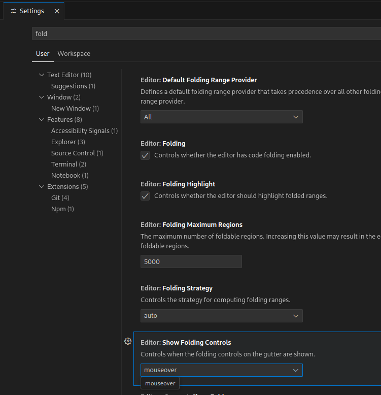
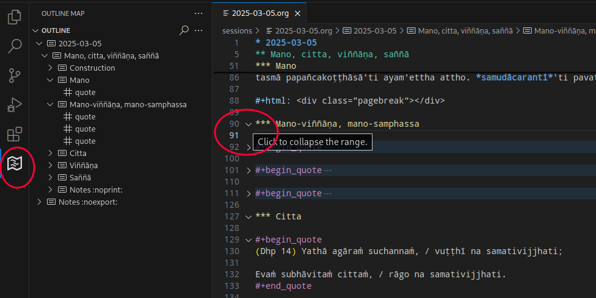

# Pāli Sutta Readings

Source branch of [pali-sutta-readings.github.io](https://pali-sutta-readings.github.io)

## Editing with VS Code

Download and install VS Code: <https://code.visualstudio.com/download>

Useful plugins:

- [vscode-org-mode](https://github.com/vscode-org-mode/vscode-org-mode)
  - (Build from github and install from VSIX. The Marketplace version is out of date.)
- [org-mode-helper-vscode](https://github.com/pali-sutta-readings/org-mode-helper-vscode)
  - Download the .vsix file from [Releases](https://github.com/pali-sutta-readings/org-mode-helper-vscode/releases)
  - Provides the command `Clipboard HTML to Org`
- [Text Tables](https://marketplace.visualstudio.com/items?itemName=RomanPeshkov.vscode-text-tables)
- [Outline Map](https://marketplace.visualstudio.com/items?itemName=Gerrnperl.outline-map)

Use `Ctrl + ,` to open Settings, type 'fold' in the search and check the folding options:





Useful keyboard shortcuts:

|                                    |                                                |
| ---------------------------------- | ---------------------------------------------- |
| Ctrl + Shift + P                   | Command Palette                                |
| Ctrl + Q Ctrl + Q                  | Toggle table editing mode (see the status bar) |
| Ctrl + Shift + P, then type 'html' | Clipboard HTML to Org                          |
| Ctrl + ,                           | VS Code Settings                               |

## Running the convert watcher and local web preview

Use the Files app to navigate to the `pali-sutta-readings.github.io-source`
folder, cloned from Github.

Right click > Open Terminal

Start the convert watcher process:

```
make convert
```

NOTE: The script creates watchers for existing `.org` files. When creating new
file `.org` file in VS Code, stop the watcher with `Ctrl + C` and start it
again, so that the new file is also watched.

Open a new terminal tab with `Ctrl + Shift + T`

Start the local web preview:

```
make preview
```

Open <https://localhost:8000>

## Publish on the github.io website 

```
make publish
```

This commits and pushes (uploads) changes in both the `source` and `main` branch.

## Editing tips

To mark a page as draft (i.e. not published on Github), insert on top:

``` org
#+draft: t
```

An org heading with the `:noexport:` tag is always excluded, never rendered to HTML.

``` org
* Notes :noexport:

Clipped texts and other research notes.
```

An org heading with the `:noprint:` tag is rendered to HTML on the sessions's web page, but is excluded on the `.../readings-print/...` url.

<https://pali-sutta-readings.github.io/readings/2025-03-05/>\\
<https://pali-sutta-readings.github.io/readings-print/2025-03-05/>

This is useful for creating the PDF for printing.

``` org
* 2025-03-05
** AN 1.11

Sutta text, vocabulary, for printing.

**** Notes :noprint:

Useful notes to include on the web page but not for printing.

** AN 2.22

Another text for printing.
```

A page break can be inserted in the print view:

``` org
#+html: <div class="pagebreak"></div>
```

## Command line tools

```
pipx install poetry
sudo apt install pandoc inotify-tools xclip
```
