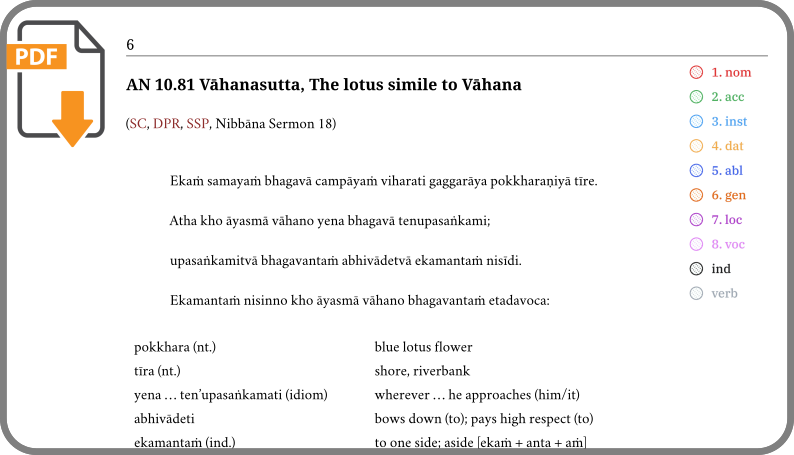

# Pāli Sutta Readings

Readings, study and discussions of the Pāli Theravāda suttas.

## Online Meetings

See the calendar below for which days have a meeting planned.

Generally, meetings are on every **Wednesday 13:00** (Europe/Lisbon time), for about 1.5hr. When the date falls on *uposatha* days, the meeting is shifted to **Thursday**. The online meetings are intended for monastics.

Meeting link: <https://meet.google.com/yip-ffjm-reo>

Whiteboard: [Pāli Readings (tldraw.com)][tldraw-readings]

Video recordings: [Pāli Readings (Google Drive)][gdrive-readings], [Pāli Readings (youtube.com)][youtube-readings]

[tldraw-readings]: https://www.tldraw.com/f/P39YAHFckegYneVo8CzE9

[gdrive-readings]: https://drive.google.com/drive/folders/1_nhb4gwvgzuWAegSboS4zI3MJY8OLnt8?usp=sharing

[youtube-readings]: https://www.youtube.com/playlist?list=PLxSN2DAE3W85GMLVm8uFV4c9U50q025tx

The PDF is updated the day before the meeting to allow printing.

<a href="https://drive.google.com/file/d/1py0_AieipKvLVj8aeZK-1flKajpjAbxi/view?usp=sharing">pali-readings.pdf</a>

<a href="https://drive.google.com/drive/folders/1hC36BKmLSJv1rp5oNvw-h7mE2oA0TVcv?usp=sharing">Anki Card Decks</a>

[readings-pdf]: https://drive.google.com/file/d/1py0_AieipKvLVj8aeZK-1flKajpjAbxi/view?usp=sharing

[readings-anki]: https://drive.google.com/drive/folders/1hC36BKmLSJv1rp5oNvw-h7mE2oA0TVcv?usp=sharing

The [pali-cheatsheet.pdf](assets/docs/pali-cheatsheet.pdf) may also be useful.

Bring colour pens for marking the cases, at least
red,
green and
blue.
A 12-shade colour-pencil pack has all the necessary shades:
nom,
acc,
inst,
dat,
abl,
gen,
loc,
voc and pencil gray for verb.

<iframe src="https://calendar.google.com/calendar/embed?height=600&wkst=2&ctz=Europe%2FLisbon&title=P%C4%81li%20Readings&src=Y185NTYzYzc3OWJkYTdhYWUyMzY0ZWE0M2QxZmZkMTI3M2JmNDQ0MTk4NTliMGNiZDA5N2M0MjA5YjVjZjRkMWFiQGdyb3VwLmNhbGVuZGFyLmdvb2dsZS5jb20&src=Y183OTY3NGJjMDcwYzcxNDgwNzFjMzMxNGUxNjVhMjEyY2JiOGYzNTIwMTExYzQyNjQ2ODRkMzhkNTdhNTdjMGU1QGdyb3VwLmNhbGVuZGFyLmdvb2dsZS5jb20&color=%237CB342&color=%23009688" style="border:solid 1px #777" width="800" height="600" frameborder="0" scrolling="no"></iframe>

## Pāli Lessons

## Notifications with RSS or Email

The RSS Feed url: <https://pali-sutta-readings.github.io/feed.xml>

Getting updates about new reading sessions:

With an **RSS reader**: [Feedbro](https://nodetics.com/feedbro/), [Feeder](https://feeder.co/), [Inoreader](https://www.inoreader.com/), etc.

With an **RSS to email** service, such as:

- [Blogtrottr](https://blogtrottr.com/)
  - It sent the update email within an hour of publishing. The free version is supported by ads.
- [Feedrabbit](https://feedrabbit.com/)
  - The free version fetches updates every 3 hours, but no ads.

Protect your email address with a forwarding alias and tracker-remover service:

<https://duckduckgo.com/email/>

## Readings Archive

[pali-readings-2023.pdf](assets/docs/pali-readings-2023.pdf)

[pali-readings-2023-answerkey.pdf](assets/docs/pali-readings-2023-answerkey.pdf)

[pali-readings-2023.apkg](assets/docs/pali-readings-2023.apkg)

[pali-readings-weavers-daughter-dhp174.pdf](assets/docs/pali-readings-weavers-daughter-dhp174.pdf)

[pali-readings-weavers-daughter-dhp174-answerkey.pdf](assets/docs/pali-readings-weavers-daughter-dhp174-answerkey.pdf)

[pali-readings-weavers-daughter-dhp174.apkg](assets/docs/pali-readings-weavers-daughter-dhp174.apkg)

