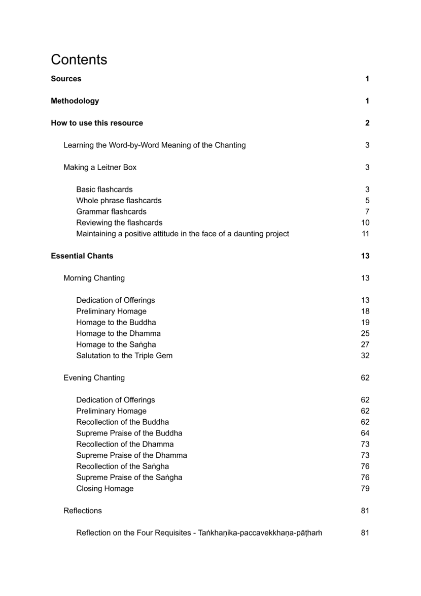

## A Word-by-Word Translation of Pāli Chanting

The following is a word-by-word explanation of the common Pāli chants to aid in memorizing along with the meaning.

The translation lines are from the [Bhikkhu Manual Reference Edition](https://bhikkhu-manual.github.io/#bhikkhu-manual-reference-edition) and Ajahn Thanissaro's [A Chanting Guide](https://www.dhammatalks.org/books/ChantingGuide/Section0000.html). The vocabulary gloss tables were produced with a mixture of LLM tools and hand editing, see the **Methodology** section.

[pali-chanting-word-by-word.pdf](assets/docs/pali-chanting-word-by-word.pdf)

